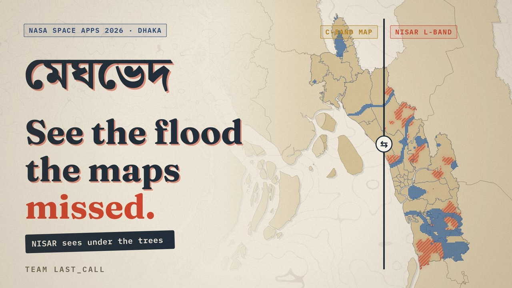
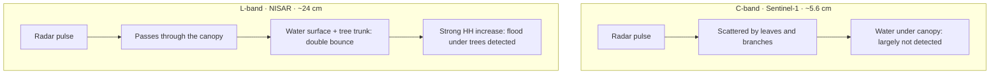
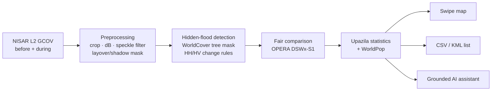
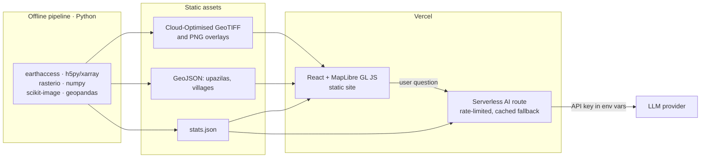

<div align="center">



# MeghBhed

**মেঘভেদ** · *piercing the clouds*

*See the flood the other maps missed.*

Using NASA–ISRO NISAR L-band radar to find flooded villages under tree cover that free C-band flood maps cannot see, and to count the people living there.

[](https://www.spaceappschallenge.org/2026/)
[](https://www.spaceappschallenge.org/2026/challenges/dancing-with-the-sars/)
[](#features--roadmap)
[](https://nisar-docs.asf.alaska.edu/)
[](LICENSE)

**Video** (link coming) · **Proposal** (coming) · **Demo** (coming at the hackathon) · **NASA project page** (coming) · [Method](docs/METHOD.md) · [Data](docs/DATA.md)
<!-- TODO: prescreening video YouTube URL -->
<!-- TODO: docs/proposal.pdf -->
<!-- TODO(hackathon): live demo URL -->
<!-- TODO: NASA Space Apps project page URL -->

</div>

> [!IMPORTANT]
> **Status: concept.** MeghBhed is Team Last_Call's entry to the NASA International Space Apps Challenge 2026 (Dhaka local event). Space Apps teams may not start building before the hackathon, so this repository contains **no project code yet**. It describes the problem, method and plan. Everything marked *Planned* will be built on 13–14 Nov 2026. Any map shown before then is a concept illustration, not a result.

## Contents

- [The problem](#the-problem)
- [Why L-band changes the picture](#why-l-band-changes-the-picture)
- [Our approach](#our-approach)
- [Hill Risk (landslides)](#hill-risk-landslides)
- [Features & roadmap](#features--roadmap)
- [Data sources](#data-sources)
- [Architecture](#architecture)
- [Getting started](#getting-started)
- [Validation & honest limits](#validation--honest-limits)
- [Team](#team)
- [Use of AI](#use-of-ai)
- [Acknowledgements](#acknowledgements)
- [References](#references)
- [How to cite](#how-to-cite)
- [License](#license)

## The problem

In July 2026, heavy rain brought flash floods and landslides to Chattogram Division and other parts of Bangladesh. By 22 July, an estimated **1.28 million people** in seven districts were affected and **59 deaths** had been reported ([UN Bangladesh Situation Report #2, 23 Jul 2026][sitrep2]).

Relief teams rely on free global flood maps such as the Copernicus Global Flood Monitoring (GFM) product and NASA's OPERA DSWx-S1. Both are built from Sentinel-1 **C-band** radar. C-band is scattered by the leaves and branches of dense vegetation, so it largely misses water underneath the canopy ([Tsyganskaya et al., 2018][tsyganskaya]).

Rural Bangladeshi homesteads sit under dense trees. When a village floods, the water can be invisible on the map the relief team is using.

> **Relief teams plan with flood maps that cannot see flooded villages under trees. Help goes where the map shows water, and families under the trees get missed.**

## Why L-band changes the picture

The NASA–ISRO **NISAR** satellite launched on 30 Jul 2025 ([NASA JPL][nisar-presskit]). Its L-band radar has a wavelength of about **24 cm**, compared with about 5.6 cm for Sentinel-1's C-band. The longer wave passes through the canopy, reflects off the flat water surface, then bounces off tree trunks straight back to the satellite. This *double bounce* makes flooded forest look **brighter** in HH polarisation, not darker ([Refice et al., 2020][refice]).

Calibrated **PROVISIONAL** NISAR products became public on 20 Jul 2026, covering observations from 17 Jun 2026 onwards ([NASA Earthdata][nisar-release]). They include passes over Chattogram before and during the July 2026 floods.



| | C-band (Sentinel-1) | L-band (NISAR) |
| --- | --- | --- |
| Wavelength | ~5.6 cm | ~24 cm |
| Open water | Dark, easy to map | Dark, easy to map |
| Water under dense trees | Mostly hidden by the canopy | Bright double bounce in HH |
| Short crops such as rice | Sensitive | Weaker; the canopy is transparent to L-band |

MeghBhed does not replace C-band maps. It **adds the layer they cannot provide**.

## Our approach

1. **Before and during.** Take NISAR L2 GCOV scenes from the same orbit track before (30 Jun 2026) and during (12 Jul 2026) the floods. Run a second check on another track (25 Jun → 19 Jul 2026).
2. **Water under trees.** Look only inside ESA WorldCover tree-cover pixels. Flag a strong HH double-bounce increase *without* a matching HV rise. Exclude built-up areas.
3. **Compare with C-band.** Overlay NASA OPERA DSWx-S1 (16 Jul 2026) and apply the fair-comparison rule below.
4. **Count the people.** Sum hidden-flood area and WorldPop 100 m population for each upazila.

**Outputs (planned):** a side-by-side swipe map · a downloadable CSV/KML list of likely-missed villages for relief organisations · a Bangla/English AI assistant that answers only from MeghBhed's computed numbers.



<details>
<summary><b>Fair-comparison rule and starting thresholds</b></summary>

<br>

A pixel is counted as **missed by C-band** only if all three hold:

1. NISAR flags hidden flood on **12 Jul 2026** (track 69, compared with 30 Jun).
2. NISAR flags hidden flood on **19 Jul 2026** (track 163, compared with 25 Jun).
3. OPERA DSWx-S1 classifies it as **not water** on **16 Jul 2026**, the C-band pass between the two NISAR dates.

Requiring agreement on both NISAR dates guards against one noisy scene. Because DSWx-S1 falls between them, C-band gets a fair chance at the same flood.

Hidden-flood rule, per pixel (γ⁰ in dB):

| Condition | Starting value | Why |
| --- | --- | --- |
| WorldCover class | Tree cover (10) only | Double bounce needs trunks |
| Built-up (class 50) | Excluded | Buildings also double-bounce |
| ΔHH = HH<sub>during</sub> − HH<sub>before</sub> | ≥ T<sub>HH</sub>, start at +3 dB | Water–trunk double bounce |
| ΔHV | ≤ T<sub>HV</sub>, start at +1 dB | Growth in the canopy itself raises HV too |
| GCOV mask / slope | Layover and shadow removed | Unreliable geometry |

These are **starting values for tuning, not results**. They will be calibrated at the hackathon against known flooded and dry sites. <!-- TODO(hackathon): calibrate T_HH and T_HV -->
Full details are in [docs/METHOD.md](docs/METHOD.md).

</details>

## Hill Risk (landslides)

Many of the July 2026 deaths were caused by landslides in the hill districts. MeghBhed's second layer points to slopes where a landslide is *possible*, for a person to **check on the ground**. It does not claim that a landslide happened.

| Input | Source | Role |
| --- | --- | --- |
| Slope | Copernicus DEM GLO-30 or NASA SRTMGL1 (30 m) | Steep terrain only |
| Rainfall, July 2026 | NASA GPM IMERG V07 (0.1°, daily) | Trigger intensity |
| Landslide hazard | NASA LHASA near-real-time nowcast (~1 km) | Independent model signal |
| Radar change on slopes | NISAR GCOV (HH/HV change) | Surface disturbance |
| Historical landslides | NASA Global Landslide Catalog (to 2016) | Context only |

**Limits.** Landslide scars can be only a few pixels wide, and slopes cause radar layover and shadow. LHASA works at about 1 km. The output is a list of places to inspect, not a detection.

## Features & roadmap

| Feature | What it does | Priority | Status |
| --- | --- | --- | --- |
| Hidden-flood map | NISAR flooding under tree cover, Chattogram and Feni | MUST | Planned |
| Swipe comparison | Side-by-side NISAR vs OPERA DSWx-S1 | MUST | Planned |
| Upazila statistics | Hidden-flood area and people per upazila | MUST | Planned |
| Missed-villages export | CSV/KML for relief organisations | SHOULD | Planned |
| Grounded AI assistant | Bangla/English answers from `stats.json` only | SHOULD | Planned |
| Hill Risk layer | "Possible landslide — check on the ground" | STRETCH | Planned |
| More regions | Haor wetlands, Sundarbans, flooded forests worldwide | STRETCH | Planned |

| Date | Milestone |
| --- | --- |
| 1 Oct 2026 | Prescreening video submitted (Dhaka local event) <!-- VERIFY: local deadline --> |
| 28 Oct 2026 | Full challenge statements released ([Space Apps][spaceapps]) |
| 13–14 Nov 2026 | Dhaka hackathon: the build happens here <!-- VERIFY: Dhaka dates; global event is 14–15 Nov --> |
| 14–15 Nov 2026 | Global Space Apps hackathon weekend ([Space Apps][spaceapps]) |
| After the hackathon | Local and global judging <!-- TODO: dates --> |

## Data sources

All inputs are free and open. Full details and access steps are in [docs/DATA.md](docs/DATA.md).

| Dataset | Provider | Used for | Resolution | Licence | Link |
| --- | --- | --- | --- | --- | --- |
| NISAR L2 GCOV (Provisional V1) | NASA/ISRO, ASF DAAC | Hidden-flood detection, slope change | 10 m (40 MHz modes) | Open, EOSDIS policy | [doi:10.5067/NIL2GCOV-P1][gcov-doi] |
| OPERA DSWx-S1 V1 | NASA JPL, PO.DAAC | C-band comparison | 30 m | Open, PO.DAAC policy; modified Copernicus data | [doi:10.5067/OPDSWS1-L3V1][dswx-doi] |
| GPM IMERG V07 (daily) | NASA GES DISC | July 2026 rainfall | 0.1° | Open, EOSDIS policy | [doi:10.5067/GPM/IMERGDL/DAY/07][imerg-doi] |
| LHASA landslide nowcast | NASA GSFC | Landslide hazard | ~1 km | Open | [NCCS data share][lhasa-nrt] |
| Global Landslide Catalog | NASA GSFC | Historical context | Point events | NASA terms of use | [data.gov][glc] |
| ESA WorldCover 2021 v200 | ESA | Tree and built-up masks | 10 m | CC BY 4.0 | [doi:10.5281/zenodo.7254221][wc-doi] |
| WorldPop population counts | WorldPop, Univ. of Southampton | People per upazila | 100 m | CC BY 4.0 | [hub.worldpop.org][worldpop] |
| Copernicus DEM GLO-30 | ESA / Copernicus | Slope | 30 m | Copernicus DEM licence | [OpenTopography][cop-dem] |
| Bangladesh admin boundaries (COD-AB) | BBS via OCHA HDX | Upazila polygons | Vector | CC BY-IGO | [HDX cod-ab-bgd][hdx] |
| Situation reports | UN Bangladesh / ICCG | Validation, context | Text | Cite source | [Sit Rep #2][sitrep2] |
| NISAR L2 GUNW (optional) | NASA/ISRO, ASF DAAC | Coherence loss on slopes | 80 m | Open, EOSDIS policy | [ASF docs][nisar-products] |

> [!NOTE]
> NISAR products released in July 2026 are **PROVISIONAL**: fully calibrated and partially validated, with processing improvements still under way ([ASF][nisar-avail]). MeghBhed labels every result from them as provisional. GUNW coverage of the study area is still to be confirmed.

## Architecture

The heavy work runs **offline** in Python. The website only serves pre-computed files, so it stays fast and cheap to host.



Planned repository layout (**planned**, not yet created):

```text
MeghBhed/
├── pipeline/          # Planned: offline Python processing (NISAR, DSWx-S1, WorldPop)
│   ├── requirements.txt
│   └── run.py
├── web/               # Planned: React + MapLibre GL JS static site
├── api/               # Planned: one serverless AI route, grounded in stats.json
├── data/
│   └── README.md      # Planned: how to fetch inputs; no raw data is committed
├── docs/
│   ├── METHOD.md
│   ├── DATA.md
│   └── assets/
├── CITATION.cff
└── LICENSE
```

## Getting started

> [!NOTE]
> Code arrives during the hackathon (13–14 Nov 2026). The commands below are the **planned** interface and will not work yet.

<details>
<summary><b>Planned commands</b></summary>

```bash
# 1. Clone
git clone https://github.com/ProttoyDip/MeghBhed.git
cd MeghBhed

# 2. NASA Earthdata login (free account: https://urs.earthdata.nasa.gov)
#    earthaccess reads credentials from ~/.netrc or environment variables
python -c "import earthaccess; earthaccess.login(persist=True)"

# 3. Install the pipeline
pip install -r pipeline/requirements.txt

# 4. Run the pipeline for one area of interest
python pipeline/run.py --aoi chattogram

# 5. Start the web app
npm --prefix web install
npm --prefix web run dev
```

</details>

## Validation & honest limits

- **Provisional data.** NISAR's July 2026 products are partially validated. Results inherit that status.
- **12-day revisit.** NISAR revisits each track every 12 days, so the flood peak may fall between passes.
- **Old land cover.** WorldCover is from 2020–21. Some trees may have been cleared since.
- **Not a replacement for C-band.** L-band is weaker than C-band for short crops such as rice. MeghBhed *complements* GFM and DSWx-S1.
- **Small landslides.** Landslide scars can be only a few pixels wide, so the Hill Risk layer only suggests where to look.
- **Partial overlap.** The two-date rule needs both tracks. Where only one covers a pixel, the result is shown at lower confidence.
- **Dates are UTC.** Acquisition dates are UTC; the 12 Jul pass was early on 13 Jul in Bangladesh time.

Results will be labelled, never stated as fact:

| Label | Meaning |
| --- | --- |
| **Likely flooded (high confidence)** | Hidden flood on both NISAR dates |
| **Possibly flooded** | Hidden flood on one NISAR date only |
| **Likely missed by C-band** | High confidence, and DSWx-S1 dry on 16 Jul |

Planned checks: comparison with affected upazilas named in [UN situation reports][sitrep2], and with geolocated news photos. <!-- TODO(hackathon): record validation results in docs/METHOD.md -->

## Team

**Team Last_Call** · Dhaka, Bangladesh

| Member | Role | GitHub |
| --- | --- | --- |
| Prottoy Saha Dip | GIS & radar processing (development) | [@ProttoyDip](https://github.com/ProttoyDip) |
| Md. Thouhidul Islam | Data analytics (development) | @TODO |
| S.M. Sao.Mio Rashid Sakin | Backend & AI (development) | @TODO |
| Shuvo Singh Partho | Frontend (development) | @TODO |
| Eva Jahan | Data collection & validation | @TODO |
| Suchismita Sarker | Presentation & design | @TODO |

Both voices in the prescreening video belong to the team's women members. <!-- TODO: add their names -->

## Use of AI

| Tool | Used for | Human contribution |
| --- | --- | --- |
| Claude (Anthropic) | Research, proposal and script drafting; prescreening-video animation and soundtrack generated as code | Team chose the problem and method, checked every fact, edited all text, recorded the voices |
| ChatGPT / Codex, GitHub Copilot | Coding assistance during the hackathon (planned) | Team designs, reviews and tests all code |
| In-app LLM | Answers user questions using only MeghBhed's computed `stats.json` | Team writes the grounding prompt and the fallback answers |

All voices in the video are real team members.

## Acknowledgements

We thank NASA, ISRO and NASA JPL for the NISAR mission; the Alaska Satellite Facility DAAC and PO.DAAC for open data access; NASA GSFC and GES DISC for IMERG and LHASA; ESA for WorldCover and Copernicus data; WorldPop; OCHA and HDX for boundary data; and the NASA Space Apps Bangladesh organisers.

## References

1. Tsyganskaya, V., Martinis, S., Marzahn, P. and Ludwig, R. (2018). SAR-based detection of flooded vegetation – a review of characteristics and approaches. *International Journal of Remote Sensing*, 39(8), 2255–2293. [doi:10.1080/01431161.2017.1420938][tsyganskaya]
2. Refice, A., Zingaro, M., D'Addabbo, A. and Chini, M. (2020). Integrating C- and L-band SAR imagery for detailed flood monitoring of remote vegetated areas. *Water*, 12(10), 2745. [doi:10.3390/w12102745][refice]
3. Wagner, W., Bauer-Marschallinger, B., Roth, F. et al. (2026). The fully-automatic Sentinel-1 Global Flood Monitoring service: scientific challenges and future directions. *Remote Sensing of Environment*, 333, 115108. [doi:10.1016/j.rse.2025.115108][gfm]
4. Inter-Cluster Coordination Group Bangladesh (2026). *Bangladesh: Flash Flood and Landslides, Situation Report #2*, 23 July 2026. [UN Bangladesh][sitrep2]

Dataset citations are listed in [docs/DATA.md](docs/DATA.md).

## How to cite

If you use MeghBhed, please cite it as below. The machine-readable version is in [CITATION.cff](CITATION.cff).

```bibtex
@software{meghbhed_2026,
  title   = {{MeghBhed}: Mapping flooding under tree cover with NISAR L-band radar},
  author  = {{Prottoy Saha Dip} and {Md. Thouhidul Islam} and {S.M. Sao.Mio Rashid Sakin} and
             {Shuvo Singh Partho} and {Eva Jahan} and {Suchismita Sarker}},
  year    = {2026},
  note    = {Team Last\_Call, NASA International Space Apps Challenge 2026},
  url     = {https://github.com/ProttoyDip/MeghBhed},
  license = {MIT}
}
```

## License

Code is released under the [MIT License](LICENSE). Each dataset keeps its own licence and attribution terms; see the [data table](#data-sources) and [docs/DATA.md](docs/DATA.md).

The app will support both Bangla and English.

---

<div align="center">
<sub>Made in Dhaka for NASA Space Apps 2026 · Team Last_Call</sub>
</div>

[sitrep2]: https://bangladesh.un.org/en/319868-bangladesh-situation-report-2-flash-flood-and-landslides-23-july-2026
[tsyganskaya]: https://doi.org/10.1080/01431161.2017.1420938
[refice]: https://doi.org/10.3390/w12102745
[gfm]: https://doi.org/10.1016/j.rse.2025.115108
[nisar-presskit]: https://www.jpl.nasa.gov/press-kits/nisar/
[nisar-release]: https://www.earthdata.nasa.gov/data/alerts-outages/nisar-l-band-data-now-publicly-available
[nisar-avail]: https://nisar-docs.asf.alaska.edu/availability-overview/
[nisar-products]: https://nisar-docs.asf.alaska.edu/products-overview/
[spaceapps]: https://www.spaceappschallenge.org/2026/
[gcov-doi]: https://doi.org/10.5067/NIL2GCOV-P1
[dswx-doi]: https://doi.org/10.5067/OPDSWS1-L3V1
[imerg-doi]: https://doi.org/10.5067/GPM/IMERGDL/DAY/07
[lhasa-nrt]: https://portal.nccs.nasa.gov/datashare/landslides/nrt/
[glc]: https://catalog.data.gov/dataset/global-landslide-catalog-export
[wc-doi]: https://doi.org/10.5281/zenodo.7254221
[worldpop]: https://hub.worldpop.org/geodata/summary?id=25280
[cop-dem]: https://portal.opentopography.org/datasetMetadata?otCollectionID=OT.032021.4326.1
[hdx]: https://data.humdata.org/dataset/cod-ab-bgd
